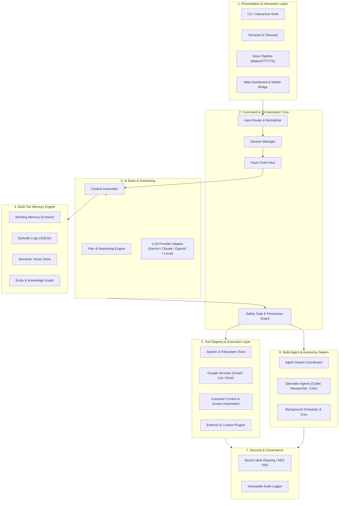
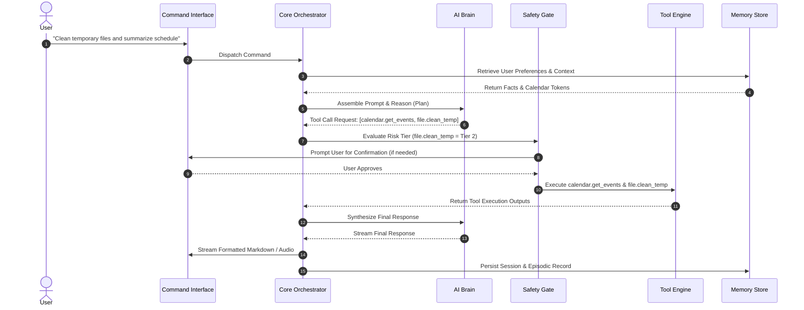

# Project JARVIS — System Architecture

This document describes the high-level architecture, subsystem boundaries, data flow pipelines, and component relationships for Project JARVIS.

---

## 1. High-Level Architecture Diagram



---

## 2. Layer & Subsystem Breakdown

### 2.1 Presentation & Interaction Layer
Provides decoupled surfaces for user interaction. Each interface client communicates with the Core Orchestrator through standard async events and streams:
- **CLI / Shell**: Fast text commands, streaming answers, and REPL operations.
- **TUI (Textual)**: Split-pane terminal interface displaying active processes, memory inspector, and event streams.
- **Voice Pipeline**: Offline wake-word detection, real-time STT transcription, and neural TTS synthesis with barge-in support.
- **Web & Mobile Gateway**: HTTP/WebSocket bridge for remote control and mobile push notifications.

### 2.2 Command & Orchestration Core
Coordinates message flow and manages global application state:
- **Input Normalizer & Router**: Distinguishes slash commands from natural language goals and background triggers.
- **Session Manager**: Manages session identifiers, active task graphs, and working state.
- **Safety Gate**: Evaluates action risk tiers (Read-Only, Safe Write, Sensitive, Destructive) and enforces human confirmation when needed.
- **Async Event Bus**: In-process publish/subscribe message bus for low-latency decoupled communication across subsystems.

### 2.3 AI Brain & Cognitive Reasoning
Handles intent comprehension, plan generation, and model interactions:
- **Model Adapter**: Normalizes API differences across Google Gemini, Anthropic Claude, OpenAI, and local LLM endpoints (e.g., Ollama).
- **Context Assembler**: Gathers relevant tokens, user profile facts, workspace metadata, and vector memory chunks within token budget limits.
- **Plan & Reasoning Engine**: Executes ReAct (Reasoning + Acting) loops, decomposes multi-stage tasks, and recovers from tool execution errors.

### 2.4 Multi-Tier Memory Subsystem
Preserves short-term, episodic, semantic, and relational knowledge:
- **Working Memory**: In-memory scratchpad and conversation sliding window.
- **Episodic Store**: Persistent transaction log of conversations and tool runs stored in SQLite.
- **Vector Memory**: Semantic document and memory embeddings for similarity search.
- **Entity & Fact Graph**: Structured key-value and relationship records representing facts, preferences, and project relationships.

### 2.5 Tool Registry & Execution Layer
Encapsulates all external interaction capabilities:
- **System Tools**: File I/O, process execution, directory navigation, and hardware resource telemetry.
- **Google Services**: Gmail, Google Calendar, and Google Drive integrations via OAuth2.
- **Computer Control**: Screen capture (VLM grounding), mouse/keyboard input synthesis, and window management.
- **Custom Tool Registry**: Dynamic plugin loader adhering to standard JSON-schema definitions.

### 2.6 Multi-Agent & Autonomy Swarm
Coordinates complex, long-running, or distributed tasks:
- **Agent Coordinator**: Spawns sub-agents, partitions work, tracks dependencies, and aggregates results.
- **Specialist Personas**: Tailored system prompts and tool constraints for specific roles (e.g., Researcher, Coder, Critic).
- **Background Scheduler**: Evaluates recurring cron jobs, reminders, and proactive triggers.

### 2.7 Security & Governance
Ensures safety, privacy, and integrity:
- **Secret Vault**: Master-key encrypted or OS-keyring backed credential management.
- **Audit Logger**: Append-only log recording every user prompt, model decision, tool invocation, and security elevation.

---

## 3. Standard Data & Execution Flow



---

## 4. Proposed Repository Directory Structure (Planned)

The following structure reflects the target codebase layout established for future implementation phases:

```
project-jarvis/
├── docs/                        # Phase 0 Blueprint & Architecture Documentation
│   ├── PROJECT_VISION.md
│   ├── CAPABILITY_MAP.md
│   ├── TECH_STACK.md
│   ├── MEMORY_MODEL.md
│   └── COMMAND_MODEL.md
├── jarvis/                      # Core Package (To be created in Phase 1+)
│   ├── __init__.py
│   ├── cli/                     # Command line interfaces, TUI, entry points
│   ├── core/                    # Event bus, configuration, session manager
│   ├── brain/                   # LLM adapters, prompt composer, reasoning engine
│   ├── tools/                   # Tool registry, filesystem, system, web tools
│   ├── integrations/            # Google services, mobile bridge, third-party APIs
│   ├── memory/                  # Vector store, episodic DB, working memory
│   ├── computer/                # GUI automation, screen capture, input synthesis
│   ├── voice/                   # Wake-word, STT, TTS, audio streaming
│   ├── agents/                  # Multi-agent coordinator and specialist roles
│   ├── autonomy/                # Schedulers, cron jobs, proactive routines
│   └── security/                # Secret vault, safety gates, audit logger
├── tests/                       # Test suite (Unit, Integration, Evals)
├── ARCHITECTURE.md              # High-level architecture document
├── SECURITY.md                  # Security policies and safety model
├── CONTRIBUTING.md              # Contributor guidelines and workflow
├── ROADMAP.md                   # Phased 13-stage project roadmap
└── TEAM_TEST.txt                # Initial repository setup marker
```
